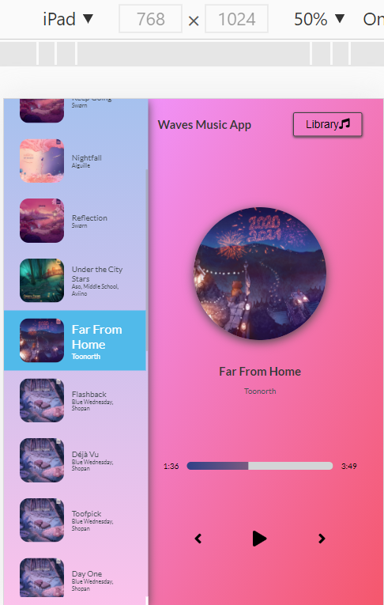
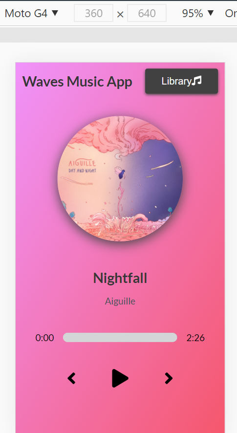

# Waves Music App
The Waves music app is a music player with a range of songs to play build with react application which is also mobile first and tablet first.

This app has a quite amount of music to listen to fetching from a free music site. I created a .js file and made my own JSON data, so no fetch api has been used but async and await has been used to include delay in the fetching of data. 

This app is styled using SASS and everything used here is custom css, thus no framework has been used. 
It has all the basic functionalities of a music player like skip-backward, skip-forward, pause, play and select from the song library.

[Live Demo](https://nervous-yalow-7b9fb8.netlify.app/)

